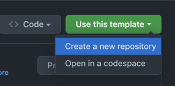

# Quick Getting Started
This is quick getting started, if u would rather look at more in depth guide with screencasts go to: https://www.craft.do/s/vwTGUOycb8cSoQ

# Prerequisite

## 1. Install node 18.x.x

## 2. Install yarn

```bash
npm install --global yarn
```

### 3. GH_PACKAGES_TOKEN

Make sure you set up environment variable named "GH_PACKAGES_TOKEN" on your machine with access token to github packages.

[How to create and add GH_PACKAGES_TOKEN for packages (video)](https://vimeo.com/777149667)

# Instructions

#### 1. Create a repo by using this template



#### 2. Install dependencies

```bash
yarn
```

#### 3. Create a Space in storyblok (https://www.storyblok.com/)

#### 4. Copy space ID

#### 5. Copy OAuth Token

[How to create Storyblok OAuth Token (video)](https://vimeo.com/777149860)

#### 7. Init the project with special command and spaceId and oauthToken passed to it as presented below: 

```bash
yarn init:project --spaceId=your-space-id --oauthToken=your-copied-oauth-token

example:
yarn init:project --spaceId=11111 --oauthToken=fIjW0rXTNFQtZQ6dsd5g23tt-57603-e57rGgsd2s5Rm3E4yBsfU
```

#### 5. Sync all Backpack components

```bash
yarn sync:components:all
```

#### 6. Sync basic boilerplate content

```bash
yarn sync:contents:all
```

#### 7. Sync datasources (there will be colors datasource for backpack-color-picker plugin, and maybe some more)

```bash
yarn sync:datasources:all
```

#### 8. Run

```bash
yarn dev
```

#### 9. Open up the preview in a new window

Navigate to https://localhost:3000 in your browser. This will accept the security certificate so that you can use the live preview pane in storyblok.

#### 10. Happy editing

Go to your site on storyblok and start building!


